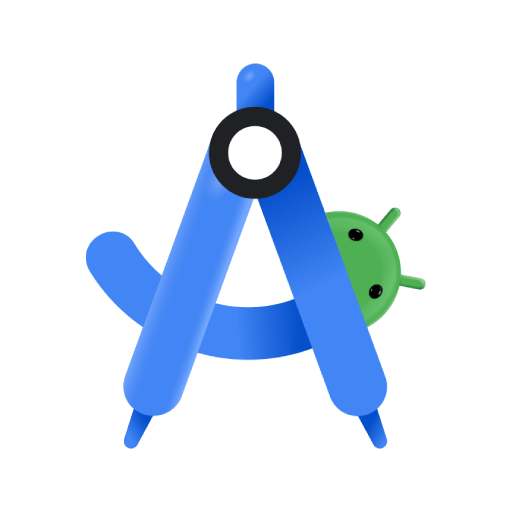
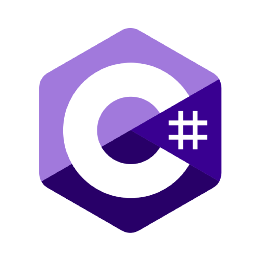
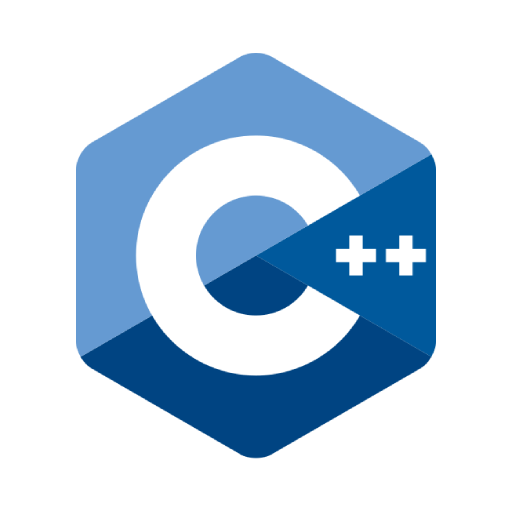

### 
I'm Léo, an IT student with a strong passion for new technologies. I'm especially drawn to projects that blend innovation and creativity, particularly in the areas of virtual reality, augmented reality, and interactive technologies.

 

## 🎓 Education

<table align="center">
  <tr>
    <td valign="top">
      <strong>Master in Industrial Engineering</strong> 
      <em>Arts et Métiers, 71100 Chalon-sur-Saône</em> 
      <ul>
        <li>Specialization: Management of Interactive 3D Technologies</li>
        <li>Virtual Reality – Augmented Reality</li>
        <li>Image Analysis – 3D Modeling</li>
      </ul>
    </td>
    <td align="center">
      
    </td>
  </tr>
  <tr>
    <td valign="top">
      <strong>Bachelor’s Degree in Computer Science</strong> 
      <em>University of Lorraine, 54500 Vandœuvre-lès-Nancy</em> 
      <ul>
        <li>Robotics – Cybersecurity – Web Development</li>
        <li>Networks – Software Development</li>
      </ul>
    </td>
    <td align="center">
      
    </td>  </tr>
  <tr>
    <td valign="top">
      <strong>General Baccalaureate</strong> 
      <em>Lycée Charles de Gaulle, 52000 Chaumont</em> 
      <ul>
        <li>Specializations: Mathematics, Computer Science, Engineering Sciences</li>
        <li>Graduated with Honors (Mention Assez Bien)</li>
      </ul>
    </td>
    <td align="center">
      
    </td>  </tr>
</table>

## 🏭🔬 Industry & Research Collaborations

<table>
  <tr>
<td>
    
  
  </td>
<td>

</a>
</td>
    <td>
  
  </a>
  </td>
  </tr>
  <tr>
    <td style="text-align: center;"><strong >
<a href="https://github.com/MansLeoo/DroneProject"style="text-decoration: none; color: inherit;" target="_blank">Ipal
</strong></td>
    <td style="text-align: center;"><strong>
<a href="https://github.com/MansLeoo/PVDproject" style="text-decoration: none; color: inherit;" target="_blank">Femto-ST</a>
</strong></td>
    <td style="text-align: center;"><strong>
<a href="https://github.com/MansLeoo/MathLearning"style="text-decoration: none; color: inherit;" target="_blank">LPC Clermont
</strong></td>  </tr>
</table>

   

<table>
  <tr>
<td>
    
  
  </td>
          <!-- Colonne vide comme espace -->
    <td style="width: 40px;"> </td>
<td>

</a>
</td>
  </tr>
  <tr>
    <td style="text-align: center;"><strong >
<a href="https://github.com/MansLeoo/Vertech" style="text-decoration: none; color: inherit;" target="_blank"> Vertech' </a>
</strong></td>
        <!-- Colonne vide comme espace -->
    <td style="width: 40px;"> </td>
    <td style="text-align: center;"><strong>
Jacques Prevot 
</strong></td>
</table>

  
## 🎓 Academic Projects

<table>
  <tr>
<td>
    
  
  </td>
<td>

</a>
</td>
    <td>
  
  </a>
  </td>
  </tr>
  <tr>
    <td style="text-align: center;"><strong >
     <a href="https://github.com/MansLeoo/ProjetTramMansLeo" style="text-decoration: none; color: inherit;" target="_blank"> Dijon Tram Project </a>
</strong></td>
    <td style="text-align: center;"><strong>
 <a href="https://github.com/MansLeoo/Menu-AR" style="text-decoration: none; color: inherit;" target="_blank">Augmented Reality Menu</a>
</strong></td>
    <td style="text-align: center;"><strong>
 <a href="https://github.com/MansLeoo/ProjetTankGame" style="text-decoration: none; color: inherit;" target="_blank">Tank Game</a>
</strong></td>  </tr>
</table>

 
 

## 🧑‍💻Technicals skills

### Adobe Software Proficiency

<table>
  <tr>
<td>
    
</td>
<td>
  

</a>
</td>
  </tr>
  <tr>
    <td style="text-align: center;"><strong >
 Photoshop
</strong></td>
    <td style="text-align: center;"><strong>
 Premiere Pro
</strong></td>
</table>

### 3D Modeling Software Proficiency

<table>
  <tr>
<td>
    
 
</td>
<td>
  
</td>
  </tr>
  <tr>
    <td style="text-align: center;"><strong >
 Blender
</strong></td>
    <td style="text-align: center;"><strong>
 3DS Max
</strong></td>
</table>

### Application Development Proficiency

<table >
  <tr>
    <td align="center">
      
    </td>
    <td align="center">
      
    </td>
    <td align="center">
      
    </td>
    <td align="center">
      
    </td>
  </tr>
  <tr>
    <td align="center"><strong>SDL2</strong></td>
    <td align="center"><strong>SFML</strong></td>
    <td align="center"><strong>Unity</strong></td>
    <td align="center"><strong>Android Studio</strong></td>
  </tr>
</table>

### Programming languages Proficiency
<table>
  <tr>
    <td align="center">
      
    </td>
    <td align="center">
      
    </td>
    <td align="center">
      
    </td>
    <td align="center">
      
    </td>
    <td align="center">
      
    </td>
    <td align="center">
      
    </td>
    <td align="center">
      
    </td>
  </tr>
  <tr>
    <td align="center"><strong>Java</strong></td>
    <td align="center"><strong>Python</strong></td>
    <td align="center"><strong>C</strong></td>
    <td align="center"><strong>C#</strong></td>
    <td align="center"><strong>C++</strong></td>
    <td align="center"><strong>PHP</strong></td>
    <td align="center"><strong>JavaScript</strong></td>
  </tr>
</table>

## Github Stats

## Connect with me

<a href="https://www.linkedin.com/in/l%C3%A9o-mans-9416b229b" target="_blank">

  

 

